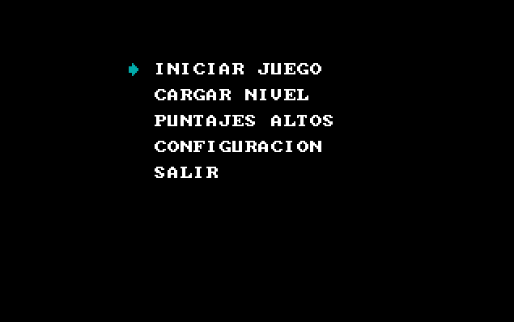

| Carnet    | Nombre                      | Auxiliar |
| --------- | --------------------------- | -------- |
| 202111835 | Ruben Alejandro Ralda Mejia | Ronald Marín

# Manual de usuario

## Menú principal
Con las flechas direccionales del teclado podremos subir o bajar la flecha y la seleccionamos con F1.

## Iniciar Juego
Las reglas del juego son simples, te mueves con los controles configurados que como default son las flechas y debes mover las cajas hasta los objetivos marcados con la X, cuando llevas la caja hasta el objetivo esta se bloquea y la única manera de mover la caja es hacerlo hacia otro objetivo. En la esquina superior derecha se encuentra el punteo y se contabiliza por cada movimiento que haga el jugador, entre menos movimiento mejor posición en el Top 10.

Es posible cargar niveles por aparte y el nombre para el primer nivel es "NIV.00" para el segundo "NIV.01" y el tercero "NIV.10", para ganar una partida se tienes que superar los tres niveles.

Se cuenta con un menú de pausa que se ingresa con el botón F2, se puede salir o regresar a la partida.

## Cargar nivel
En esta opción se repite la misma jugabilidad con la diferencia de que se escribe el nombre del nivel y una vez superado regresamos al menú principal.

## Puntajes altos
Se muestra cada puesto del Top 10 mejores punteos, cuando finalizamos una partida y nuestro punteo puede entrar, se escribe en el archivo "HIGHSC.BIN" con el nombre de 3 letras. Entre menos movimientos se haga en partida, mejor punteo se recibe.

## Configuracion
En esta pantalla podremos observar los controles actuales del movimiento y se cuenta con dos opciones, configurar o salir. Configurar hace que se pueda cambiar las teclas para el movimiento, se nos pide primero la de abajo, luego arriba, después derecha y por último izquierda, en ese orden se ingresa las teclas que van a reemplazar las default para el movimiento.

